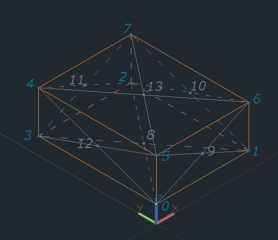
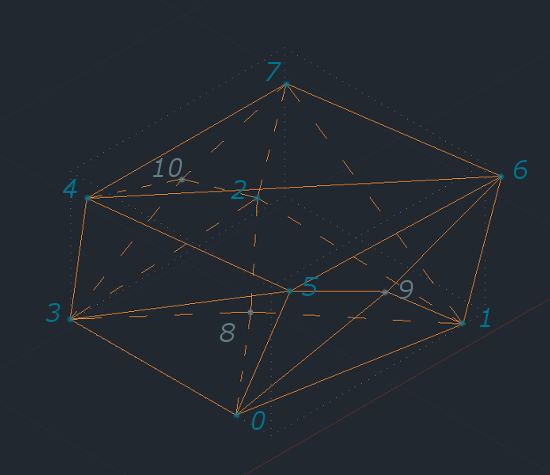

### Формат данных

Результатом работы генератора является описание трехмерного конфигурационного пространства в формате JSON.
Визуализатор способен прочитать данный формат и отобразить конфигурационное простанство в графическом виде.
Также визуализатор может считать и отобразить путь в JSON-формате.

Использованы следующие базовые объекты: точка, путь, треугольная грань, препятствие, конфигурационное пространство


#### Точки

Каждая точка представлена в виде трех пар ключ-значение, соответствующих ее координатам

``` JSON
{
  "X":0,
  "Y":0,
  "Z":0
}
```


#### Путь

Путь (для визуализатора) представлен массивои точек с ключом `Path`

``` JSON
{  
  "Path":[  
    {  
      "X":9.8,
      "Y":9.5,
      "Z":9.1
    },
    {  
      "X":3.8,
      "Y":5,
      "Z":9
    },
    {  
      "X":0.5,
      "Y":0.3,
      "Z":0.9
    }
  ]
}
```


#### Треугольные грани

Каждая треугольная грань представлена в виде трех пар ключ-значение, в которых содержатся **номера** точек из массива

``` JSON
{
  "First":0,
  "Second":1,
  "Third":5
}
```


#### Препятствия

Многогранные препятствия представлены в виде JSON-объекта, включающего в себя следующие поля:

* `Id` - целочисленный идентификатор
* `Edge` - массив точек - вершин препятствия
* `Faсet` - массив треугольных граней с номерами точек из массива `Edge`

Каждое препятствие представляет собой многогранник (в том числе невыпуклый), имеющий от 12 до 24 треугольных граней.
Препятсивия формируются из параллелепипеда смещением его вершин и добавлением дополнительных вершин со смещением по центру граней исходного параллелепипеда

Многогранники препятствий заданы массивом координат вершин и фасетами - тройками номеров составляющих их вершин.
В массиве координат вершин вначале перечислены обязательные (вершины исходного параллелепипеда), потом имеющиеся дополнительные (вершины по центрам граней, некторые из дополнительных вершин могут отсутствовать).
Порядок основных вершин и дополнительных вершин в массиве приведен на рисунке ниже и соответствует нумерации  снизу вверх против часовой стрелки, начиная с нуля - ближайшей  к началу координат вершины

Пояснение к нумерации вершин  


Пример препятствия с восемнадцатью гранями  



Пример JSON-описания объекта препятствия приведен ниже в следующем разделе


#### Конфигурационное пространство

Объект конфигурационного пространства представлен в виде последовательности полей:

* `Description` - строка с описанием использованных при генерации параметров
* `Border` - массив точек внешних границ куба конфигурационного пространства
* `Start` - координаты стартовой точки
* `Finish` - координаты конечной точки
* `Obstacle` - массив препятствий

В сгенерированном конфигурационном пространсве *гарантируется* отсутствие пересечений препятствий, а также то, что стартовая и конецная точки не будут находиться в запретной оболасти

Пример файла конфигурационного пространства с двумя препятствиями:

``` JSON
{  
  "Description":"c-space 10.00 x 10.00 x 10.00, fullness value 1, seed 99",
  "Border":[  
    {  
      "X":0,
      "Y":0,
      "Z":0
    },
    {  
      "X":10,
      "Y":0,
      "Z":0
    },
    {  
      "X":10,
      "Y":10,
      "Z":0
    },
    {  
      "X":0,
      "Y":10,
      "Z":0
    },
    {  
      "X":0,
      "Y":10,
      "Z":10
    },
    {  
      "X":0,
      "Y":0,
      "Z":10
    },
    {  
      "X":10,
      "Y":0,
      "Z":10
    },
    {  
      "X":10,
      "Y":10,
      "Z":10
    }
  ],
  "Start":{  
    "X":0.0063581730392865046,
    "Y":0.006718283010240068,
    "Z":0.006286054304543276
  },
  "Finish":{  
    "X":9.995495201171428,
    "Y":9.990437244050622,
    "Z":9.996818346802998
  },
  "Obstacle":[  
    {  
      "Id":0,
      "Edge":[  
        {  
          "X":3.0822953980065897,
          "Y":0.8637674126710935,
          "Z":0.48211281866144534
        },
        {  
          "X":4.336746380308467,
          "Y":1.7149722468525876,
          "Z":0.876473535341367
        },
        {  
          "X":4.211567186654344,
          "Y":3.084265848677245,
          "Z":0.4455112847196416
        },
        {  
          "X":2.3036079717980575,
          "Y":2.3693453872613253,
          "Z":0.5879804073228232
        },
        {  
          "X":2.0537838537979787,
          "Y":2.2191555742093447,
          "Z":1.8596712257941082
        },
        {  
          "X":2.3036079717980575,
          "Y":0.9008705765199441,
          "Z":2.594863018961268
        },
        {  
          "X":4.851027310684749,
          "Y":1.300707855373139,
          "Z":1.8742697228869194
        },
        {  
          "X":4.11572720529785,
          "Y":2.961646537673131,
          "Z":1.9548165733991714
        },
        {  
          "X":3.7121951131122817,
          "Y":1.9820448383539069,
          "Z":1.2161268880354863
        },
        {  
          "X":5.18905688610808,
          "Y":2.1424589311651303,
          "Z":1.774278869035787
        },
        {  
          "X":3.769249315531943,
          "Y":2.6633818213346747,
          "Z":1.7806319768056915
        }
      ],
      "Facet":[  
        {  
          "First":0,
          "Second":3,
          "Third":8
        },
        {  
          "First":0,
          "Second":8,
          "Third":1
        },
        {  
          "First":1,
          "Second":8,
          "Third":2
        },
        {  
          "First":2,
          "Second":8,
          "Third":3
        },
        {  
          "First":6,
          "Second":5,
          "Third":0
        },
        {  
          "First":6,
          "Second":0,
          "Third":1
        },
        {  
          "First":1,
          "Second":2,
          "Third":9
        },
        {  
          "First":1,
          "Second":9,
          "Third":6
        },
        {  
          "First":6,
          "Second":9,
          "Third":7
        },
        {  
          "First":7,
          "Second":9,
          "Third":2
        },
        {  
          "First":2,
          "Second":3,
          "Third":10
        },
        {  
          "First":2,
          "Second":10,
          "Third":7
        },
        {  
          "First":7,
          "Second":10,
          "Third":4
        },
        {  
          "First":4,
          "Second":10,
          "Third":3
        },
        {  
          "First":5,
          "Second":4,
          "Third":3
        },
        {  
          "First":5,
          "Second":3,
          "Third":0
        },
        {  
          "First":4,
          "Second":5,
          "Third":6
        },
        {  
          "First":4,
          "Second":6,
          "Third":7
        }
      ]
    },
    {  
      "Id":1,
      "Edge":[  
        {  
          "X":2.495186370364693,
          "Y":0.41551443682869704,
          "Z":5.865792219259882
        },
        {  
          "X":4.062257721975189,
          "Y":0.4054529476235682,
          "Z":6.204435659035616
        },
        {  
          "X":3.8443844558204234,
          "Y":1.184815278515754,
          "Z":6.351891757501948
        },
        {  
          "X":1.9270338273525038,
          "Y":1.184815278515754,
          "Z":5.865792219259882
        },
        {  
          "X":1.4762328815557424,
          "Y":1.184815278515754,
          "Z":8.052321634792515
        },
        {  
          "X":1.9270338273525038,
          "Y":0.365727915655491,
          "Z":7.314351813071329
        },
        {  
          "X":4.498482517684449,
          "Y":0,
          "Z":7.181519454789241
        },
        {  
          "X":4.831036305216144,
          "Y":1.184815278515754,
          "Z":7.732492171902893
        },
        {  
          "X":3.2127581725184764,
          "Y":1.184815278515754,
          "Z":6.855475427023288
        },
        {  
          "X":2.383591442223426,
          "Y":0.7048171886710337,
          "Z":6.808613709273864
        }
      ],
      "Facet":[  
        {  
          "First":0,
          "Second":3,
          "Third":2
        },
        {  
          "First":0,
          "Second":2,
          "Third":1
        },
        {  
          "First":6,
          "Second":5,
          "Third":0
        },
        {  
          "First":6,
          "Second":0,
          "Third":1
        },
        {  
          "First":1,
          "Second":2,
          "Third":7
        },
        {  
          "First":1,
          "Second":7,
          "Third":6
        },
        {  
          "First":2,
          "Second":3,
          "Third":8
        },
        {  
          "First":2,
          "Second":8,
          "Third":7
        },
        {  
          "First":7,
          "Second":8,
          "Third":4
        },
        {  
          "First":4,
          "Second":8,
          "Third":3
        },
        {  
          "First":5,
          "Second":4,
          "Third":9
        },
        {  
          "First":5,
          "Second":9,
          "Third":0
        },
        {  
          "First":0,
          "Second":9,
          "Third":3
        },
        {  
          "First":3,
          "Second":9,
          "Third":4
        },
        {  
          "First":4,
          "Second":5,
          "Third":6
        },
        {  
          "First":4,
          "Second":6,
          "Third":7
        }
      ]
    }
  ]
}
```
