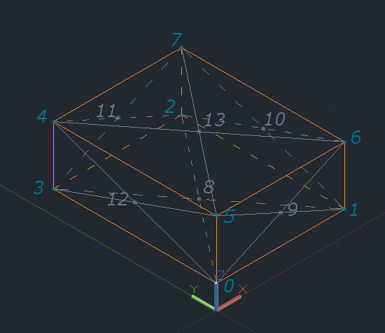
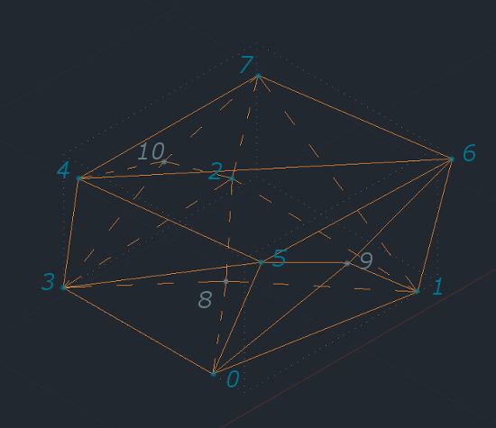

### Форматы данных

Результатом работы генератора является описание трехмерного конфигурационного пространства в формате JSON.
Визуализатор способен прочитать данный формат и отобразить конфигурационное простанство в графическом виде.
Также визуализатор может считать и отобразить путь в JSON-формате.

[Инструкции по генератору](generator.md)  
[Инструкции по визуализатору](visualizer.md)  
[Возврат на главную станицу](../README.md)

#### Используемые объекты

Использованы следующие базовые объекты: точка, путь, треугольная грань, препятствие, конфигурационное пространство.


##### Точки

Каждая точка представлена в виде трех пар ключ-значение, соответствующих ее координатам.

``` JSON
{
  "X":0,
  "Y":0,
  "Z":0
}
```


##### Путь

Путь (для визуализатора) представлен массивом точек с ключом `Path`.

``` JSON
{  
  "Path":[  
    {  
      "X":9.8,
      "Y":9.5,
      "Z":9.1
    },
    {  
      "X":3.8,
      "Y":5,
      "Z":9
    },
    {  
      "X":0.5,
      "Y":0.3,
      "Z":0.9
    }
  ]
}
```


##### Треугольные грани

Каждая треугольная грань представлена в виде трех пар ключ-значение, в которых содержатся **номера** точек.

``` JSON
{
  "First":0,
  "Second":1,
  "Third":5
}
```


##### Препятствия

Многогранные препятствия представлены в виде JSON-объекта, включающего в себя следующие поля:

* `Vertex` - массив точек - вершин препятствия
* `Faсet` - массив треугольных граней с номерами точек из массива `Vertex`

Каждое препятствие представляет собой многогранник (в том числе невыпуклый), имеющий от 12 до 24 треугольных граней.
Препятствия формируются из параллелепипеда смещением его вершин и добавлением дополнительных вершин со смещением по центру граней исходного параллелепипеда.

В массиве координат вершин вначале перечислены обязательные (вершины исходного параллелепипеда), потом дополнительные (вершины по центрам граней, некторые из дополнительных вершин могут отсутствовать).
Порядок основных вершин и дополнительных вершин в массиве приведен на рисунке ниже и соответствует нумерации  снизу вверх против часовой стрелки, начиная с нуля - ближайшей  к началу координат вершины.

Пояснение к нумерации вершин:  


Пример препятствия с восемнадцатью гранями:  



Пример JSON-описания объекта препятствия приведен ниже в следующем разделе.


##### Конфигурационное пространство

Объект конфигурационного пространства представлен в виде последовательности полей:

* `Description` - строка с описанием использованных при генерации параметров
* `Vertex` - массив точек внешних границ куба конфигурационного пространства
* `Start` - координаты стартовой точки
* `Finish` - координаты конечной точки
* `Obstacle` - массив препятствий

В сгенерированном конфигурационном пространсве *гарантируется* отсутствие пересечений препятствий, а также то, что стартовая и конечная точки не будут находиться в запретной области.

Пример файла конфигурационного пространства с тремя препятствиями:

``` JSON
{
  "Description":"c-space 10.00 x 10.00 x 10.00, fullness value 1, seed 99",
  "Vertex":[
    {
      "X":0,
      "Y":0,
      "Z":0
    },
    {
      "X":10,
      "Y":0,
      "Z":0
    },
    {
      "X":10,
      "Y":10,
      "Z":0
    },
    {
      "X":0,
      "Y":10,
      "Z":0
    },
    {
      "X":0,
      "Y":10,
      "Z":10
    },
    {
      "X":0,
      "Y":0,
      "Z":10
    },
    {
      "X":10,
      "Y":0,
      "Z":10
    },
    {
      "X":10,
      "Y":10,
      "Z":10
    }
  ],
  "Start":{
    "X":0.06358173039286498,
    "Y":0.0671828301024006,
    "Z":0.06286054304543269
  },
  "Finish":{
    "X":9.954952011714273,
    "Y":9.90437244050622,
    "Z":9.968183468029974
  },
  "Obstacle":[
    {
      "Vertex":[
        {
          "X":2.2794299277690766,
          "Y":0.6328105964890283,
          "Z":0.09895424118520318
        },
        {
          "X":6.496030097915002,
          "Y":1.5532206990162756,
          "Z":0.19581083600896976
        },
        {
          "X":6.136853469001386,
          "Y":3.107495088782115,
          "Z":0.2502050675099806
        },
        {
          "X":2.5036954157151423,
          "Y":3.936560090028274,
          "Z":0.09968207843528404
        },
        {
          "X":1.1455594823489461,
          "Y":3.9698862840952476,
          "Z":1.6813701836805712
        },
        {
          "X":2.3254104973005476,
          "Y":1.3029252893988832,
          "Z":2.322897650238091
        },
        {
          "X":6.136853469001386,
          "Y":1.5342440333388065,
          "Z":1.5790637090757362
        },
        {
          "X":4.70055277936658,
          "Y":4.098188110331628,
          "Z":2.464440129900562
        },
        {
          "X":3.7716150825831587,
          "Y":2.3539186532126095,
          "Z":0.7969364759757607
        },
        {
          "X":3.783854507978208,
          "Y":1.4421345411783786,
          "Z":1.276163524676425
        },
        {
          "X":6.136853469001386,
          "Y":2.2151504382800384,
          "Z":1.4311383135393334
        },
        {
          "X":3.885425431733584,
          "Y":2.7462728752959427,
          "Z":1.3057917014082427
        },
        {
          "X":3.8941634625107175,
          "Y":2.5026742993943323,
          "Z":2.29947621137311
        }
      ],
      "Facet":[
        {
          "First":0,
          "Second":3,
          "Third":8
        },
        {
          "First":0,
          "Second":8,
          "Third":1
        },
        {
          "First":1,
          "Second":8,
          "Third":2
        },
        {
          "First":2,
          "Second":8,
          "Third":3
        },
        {
          "First":6,
          "Second":5,
          "Third":9
        },
        {
          "First":6,
          "Second":9,
          "Third":1
        },
        {
          "First":1,
          "Second":9,
          "Third":0
        },
        {
          "First":0,
          "Second":9,
          "Third":5
        },
        {
          "First":1,
          "Second":2,
          "Third":10
        },
        {
          "First":1,
          "Second":10,
          "Third":6
        },
        {
          "First":6,
          "Second":10,
          "Third":7
        },
        {
          "First":7,
          "Second":10,
          "Third":2
        },
        {
          "First":2,
          "Second":3,
          "Third":11
        },
        {
          "First":2,
          "Second":11,
          "Third":7
        },
        {
          "First":7,
          "Second":11,
          "Third":4
        },
        {
          "First":4,
          "Second":11,
          "Third":3
        },
        {
          "First":5,
          "Second":4,
          "Third":3
        },
        {
          "First":5,
          "Second":3,
          "Third":0
        },
        {
          "First":4,
          "Second":5,
          "Third":12
        },
        {
          "First":4,
          "Second":12,
          "Third":7
        },
        {
          "First":7,
          "Second":12,
          "Third":6
        },
        {
          "First":6,
          "Second":12,
          "Third":5
        }
      ]
    },
    {
      "Vertex":[
        {
          "X":1.0189174935328875,
          "Y":0,
          "Z":6.440458953612538
        },
        {
          "X":6.757738223706076,
          "Y":0.5231331090514789,
          "Z":6.442246598317826
        },
        {
          "X":4.802914769350609,
          "Y":2.5783930890375473,
          "Z":6.62793342727825
        },
        {
          "X":2.5767708991833542,
          "Y":2.2032029402289033,
          "Z":5.52227308088466
        },
        {
          "X":0.9182104278632557,
          "Y":2.572977132442866,
          "Z":8.499655652632086
        },
        {
          "X":2.527953502677023,
          "Y":0.035176690276567675,
          "Z":8.179937794069431
        },
        {
          "X":5.043273124387325,
          "Y":0.035176690276567675,
          "Z":9.222529921671775
        },
        {
          "X":6.6325780303147885,
          "Y":1.573592295697636,
          "Z":9.62478527616084
        },
        {
          "X":3.8492646245375752,
          "Y":1.3597340195693626,
          "Z":5.450151652958649
        },
        {
          "X":6.38565523468747,
          "Y":1.289716859128333,
          "Z":8.07419184435074
        },
        {
          "X":4.34044604865651,
          "Y":1.7594336679989928,
          "Z":7.587779161414103
        },
        {
          "X":2.715889081902289,
          "Y":1.1191898152527355,
          "Z":7.546095330557837
        },
        {
          "X":4.1330301626010355,
          "Y":1.1365090919956695,
          "Z":8.380840286171502
        }
      ],
      "Facet":[
        {
          "First":0,
          "Second":3,
          "Third":8
        },
        {
          "First":0,
          "Second":8,
          "Third":1
        },
        {
          "First":1,
          "Second":8,
          "Third":2
        },
        {
          "First":2,
          "Second":8,
          "Third":3
        },
        {
          "First":6,
          "Second":5,
          "Third":0
        },
        {
          "First":6,
          "Second":0,
          "Third":1
        },
        {
          "First":1,
          "Second":2,
          "Third":9
        },
        {
          "First":1,
          "Second":9,
          "Third":6
        },
        {
          "First":6,
          "Second":9,
          "Third":7
        },
        {
          "First":7,
          "Second":9,
          "Third":2
        },
        {
          "First":2,
          "Second":3,
          "Third":10
        },
        {
          "First":2,
          "Second":10,
          "Third":7
        },
        {
          "First":7,
          "Second":10,
          "Third":4
        },
        {
          "First":4,
          "Second":10,
          "Third":3
        },
        {
          "First":5,
          "Second":4,
          "Third":11
        },
        {
          "First":5,
          "Second":11,
          "Third":0
        },
        {
          "First":0,
          "Second":11,
          "Third":3
        },
        {
          "First":3,
          "Second":11,
          "Third":4
        },
        {
          "First":4,
          "Second":5,
          "Third":12
        },
        {
          "First":4,
          "Second":12,
          "Third":7
        },
        {
          "First":7,
          "Second":12,
          "Third":6
        },
        {
          "First":6,
          "Second":12,
          "Third":5
        }
      ]
    },
    {
      "Vertex":[
        {
          "X":4.813686240794587,
          "Y":1.3660825061754918,
          "Z":2.5923544819648643
        },
        {
          "X":7.777739528991319,
          "Y":0.12275793812765651,
          "Z":2.716834235246212
        },
        {
          "X":9.180230363096166,
          "Y":4.199336955994116,
          "Z":3.3314924167117916
        },
        {
          "X":2.903499602145146,
          "Y":3.021443130145956,
          "Z":3.4556142393327587
        },
        {
          "X":2.903499602145146,
          "Y":3.2172174342028503,
          "Z":5.186216862847171
        },
        {
          "X":2.5656385200925746,
          "Y":0.012720582871575736,
          "Z":4.958440652546377
        },
        {
          "X":8.781831657918065,
          "Y":1.3446517861419651,
          "Z":5.243356397868448
        },
        {
          "X":6.8974043217683025,
          "Y":3.929626511689667,
          "Z":4.467099019897848
        },
        {
          "X":9.123961089442956,
          "Y":2.1865176900363195,
          "Z":4.148301766966743
        },
        {
          "X":5.842665630031606,
          "Y":3.929626511689667,
          "Z":4.212052903796328
        },
        {
          "X":4.362750306421926,
          "Y":2.1865176900363195,
          "Z":3.974957011794494
        },
        {
          "X":6.077891646827766,
          "Y":2.4230607092082552,
          "Z":4.958440652546377
        }
      ],
      "Facet":[
        {
          "First":0,
          "Second":3,
          "Third":2
        },
        {
          "First":0,
          "Second":2,
          "Third":1
        },
        {
          "First":6,
          "Second":5,
          "Third":0
        },
        {
          "First":6,
          "Second":0,
          "Third":1
        },
        {
          "First":1,
          "Second":2,
          "Third":8
        },
        {
          "First":1,
          "Second":8,
          "Third":6
        },
        {
          "First":6,
          "Second":8,
          "Third":7
        },
        {
          "First":7,
          "Second":8,
          "Third":2
        },
        {
          "First":2,
          "Second":3,
          "Third":9
        },
        {
          "First":2,
          "Second":9,
          "Third":7
        },
        {
          "First":7,
          "Second":9,
          "Third":4
        },
        {
          "First":4,
          "Second":9,
          "Third":3
        },
        {
          "First":5,
          "Second":4,
          "Third":10
        },
        {
          "First":5,
          "Second":10,
          "Third":0
        },
        {
          "First":0,
          "Second":10,
          "Third":3
        },
        {
          "First":3,
          "Second":10,
          "Third":4
        },
        {
          "First":4,
          "Second":5,
          "Third":11
        },
        {
          "First":4,
          "Second":11,
          "Third":7
        },
        {
          "First":7,
          "Second":11,
          "Third":6
        },
        {
          "First":6,
          "Second":11,
          "Third":5
        }
      ]
    }
  ]
}
```
