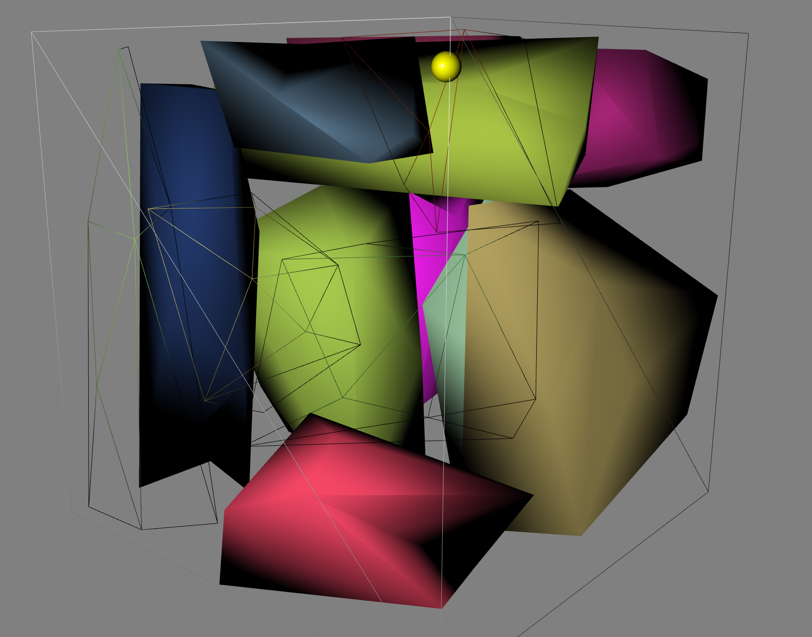
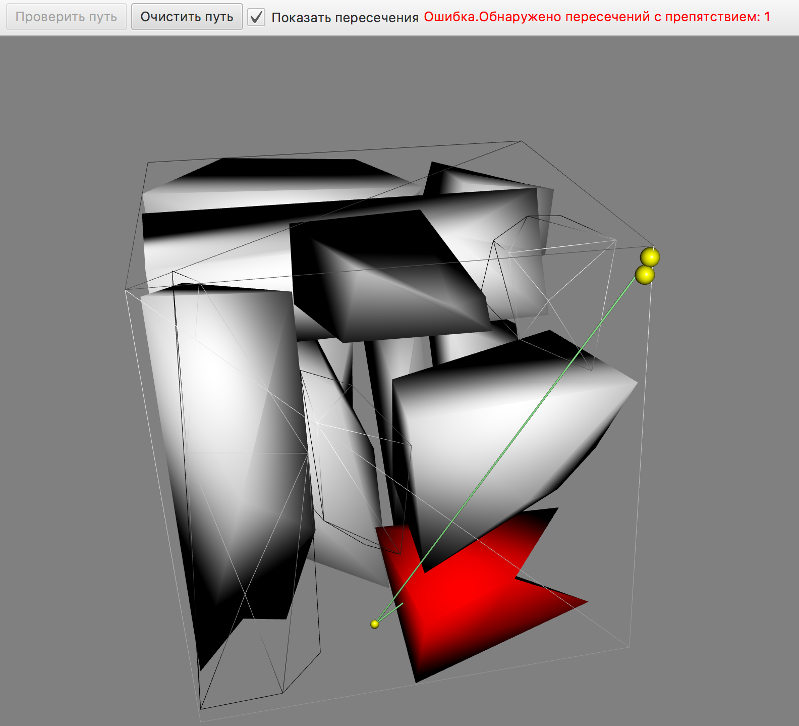

### Визуализация и проверка пути

Визуализатор представляет собой Java приложение, написанное с  помощью библиотеки JavaFX.
Дополнительными зависимостями является библиотека Jackson для работы с JSON форматом данных.
Поставляется в виде исполняемого .jar файла в директории `/bin` - ObstacleVisualizer.jar

### Внешний вид и части визуализатора

Приложение визуализации состоит из 2 частей:
* 3D сцена для отображения объектов.
* Toolbar для загрузки и работы с путем.

### 3D сцена  

3D сцена позволяет отображать загруженные препятствия, строить путь и осуществлять навигацию по сцене.

В визуализаторе используются следующие клавиши:
* W - перемещение вперед
* A - перемещение влево
* S - перемещение назад
* D - перемещение вправо
* `Space` - перемещение вверх
* `Ctrl` - перемещение вниз
* `Shift` - модификатор длины перемещения (при зажатой клавиши увеличивается путь, на который перемещается камера)
* `ESC`- выход из программы

Все перемещения выполняются при учете соответствующего направления камеры.

Вращение камеры осуществляется путем зажатия `Левой` клавиши мыши и поворотом мыши в соответствующее движению направление без инверсии движения (при направлении вправо камера будет повернута в право)

Пример сцены с загруженными препятствиями и путем (`/samples/field.json`)

При нажатии на соответствующее препятствие, возможно изменение его отображения со сплошного на отображение ребер

### Проверка пересечения пути

Для проверки пересечения пути загружается файл, содержащий точки пути в формате JSON. Пример файла находится в `/samples/path.json`

После разбора файла, визуализатор отображает заданный путь на сцене и показывает наличие пересечений с другими препятствиями.
При выборе галочки показать пересечения, препятствия с которыми произошло пересечение будут окрашены в красный цвет.

При нажатии очистить путь, можно выбрать новый файл для загруки пути

### Работа с визуализатором
При запуске приложения `/bin/ObstacleVisualizer.jar`открывается окно для выбора файла с описанным полем (примеры полей можно увидеть в `/samples/fileds`). После загрузке сцены, пользователю предоставляется возможность работать со сценой как описано в [3D сцена](#3D-scene).
Для загрузки пути необходимо нажать кнопку `Проверить путь` и выбрать файл с описанным путем (пример файла можно увидеть в `/samples/path`). После загрузки пути, если будут пересечения с препятсвием загорится соответствующая надпись.
