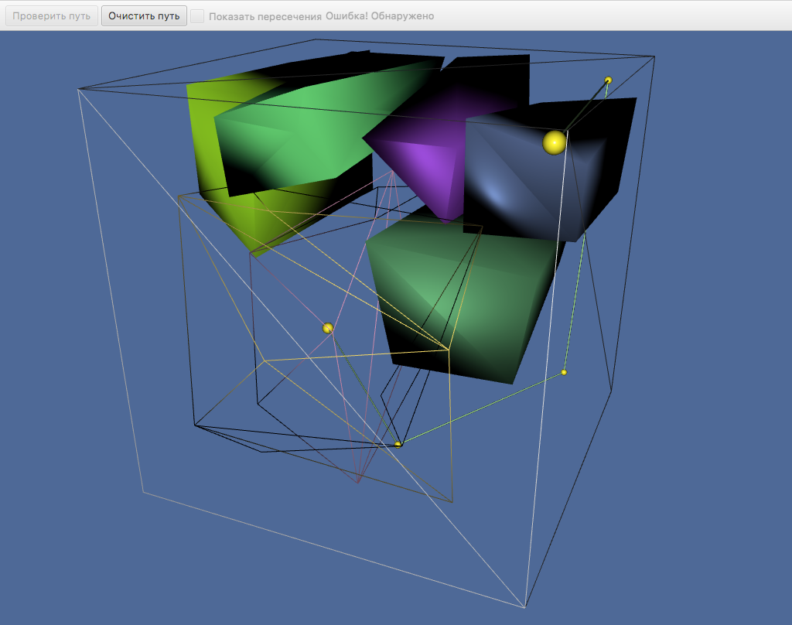
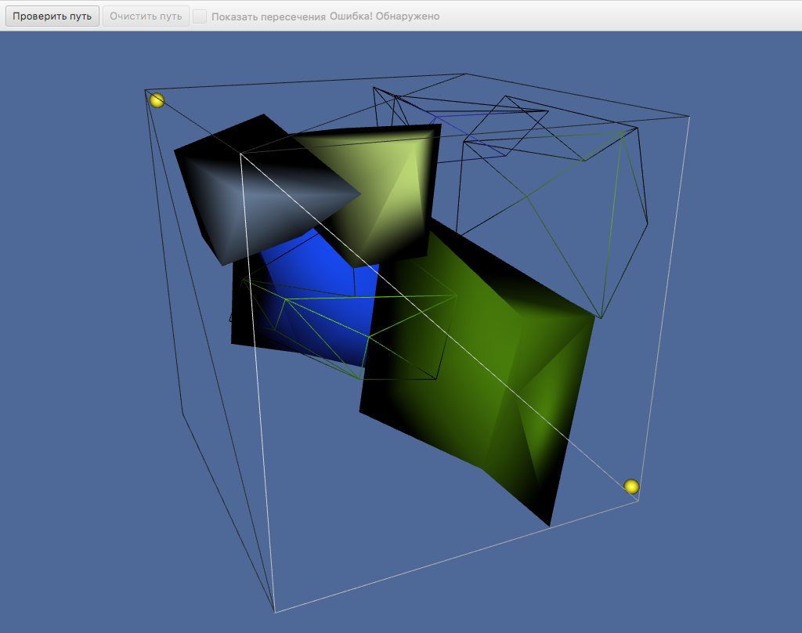
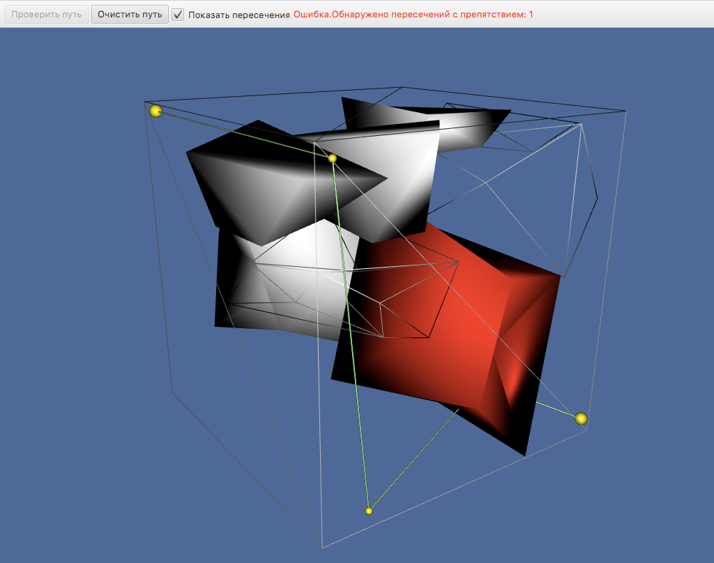

### Визуализация и проверка пути

Визуализатор конфигурационных пространств представляет собой Java-приложение, написанное с помощью библиотеки JavaFX.
Дополнительными зависимостями является библиотека Jackson для работы с JSON.
Описание формата данных приведено [здесь](formats.md).

Кроссплатформенный ***исполняемый jar-файл*** приложения `ObstacleVisualizer.jar` можно загрузить [отсюда](https://github.com/vvoZokk/c-space-processing/tree/master/visualizer/binary) (для запуска необходима установленная Java версии не ниже 8).

#### Внешний вид и части визуализатора

Приложение визуализатора состоит из 2 частей:

* 3D-сцена для отображения объектов
* Toolbar для загрузки и работы с путем

#### Работа с визуализатором

При запуске визуализатора открывается окно для выбора файла конфигурационного пространства в формате JSON.
После загрузке сцены пользователю предоставляется возможность перемещения по сцене при помощи мыши и управляющих клавиш.
Для загрузки пути необходимо нажать кнопку "Проверить путь" и выбрать JSON-файл пути.
После загрузки выбранного файла производится проверка на наличие пересечений с препятсвиями, и, если пересечения будут обнаружены, в верхней части окна появится соответствующая надпись.

##### Навигация по 3D-сцене

3D-сцена позволяет отображать загруженное конфигурационное пространство, путь и осуществлять перемещение по сцене.

В визуализаторе используются следующие клавиши:

* `W` - перемещение вперед
* `A` - перемещение влево
* `S` - перемещение назад
* `D` - перемещение вправо
* `Space` - перемещение вверх
* `Ctrl` - перемещение вниз
* `Shift` - модификатор шага перемещения (при зажатой клавише увеличивается расстояние, на которое перемещается камера)
* `Esc`- выход из программы

Все перемещения выполняются при учете направления камеры.
Вращение камеры осуществляется путем зажатия любой клавиши мыши и поворотом мыши в соответствующее движению направление без инверсии.

Пример сцены с загруженными препятствиями и путем из папки [examples](../examples):

Щелчок по любому из препятствий изменяет его отображение со сплошного на отображение ребер и наоборот:

##### Проверка пересечения пути

Для проверки пересечения загружается файл, содержащий точки пути в формате JSON.
Пример файла имеется в папке [examples](../examples).

После разбора файла визуализатор отображает заданный путь на сцене и показывает наличие пересечений с препятствиями.
При установке флага "Показать пересечения" препятствия, с которыми произошло пересечение, будут окрашены в красный цвет.
После нажатия на кнопку "Очистить путь" можно выбрать новый файл для загруки пути:

#### Сборка визуализатора

Визуализатор реализован на языке Java, для сборки визуализатора из исходных файлов требуется установленный JDK.

Для сборки в IntelliJ IDEA необходимо выполнить импортирование проекта из папки `visualizer`.
В настройках импорта выбрать `Import project form external model` и указать на `Maven`.
Во всех последующих диалоговых окнах можно остатавлять параметры по умолчанию и нажимать на `Next`.
После завершения импорта на панели `Maven Projects` зайти в раздел `Plugins`, подраздел `assembly` и, щелкнув по пункту `assembly:single`, установить выполнения после сборки `After Build`.
Для добавления конфигурации достаточно выбрать `Run` в контексном меню основного класса приложения `ObstacleVisualizer` в окне дерева проекта.

Документация по исходному коду визуализатора может быть получена при помощи Javadoc.
Для корректной генерации необходимы следующие аргументы: `-encoding UTF-8 -docencoding UTF-8 -charset UTF-8`.
